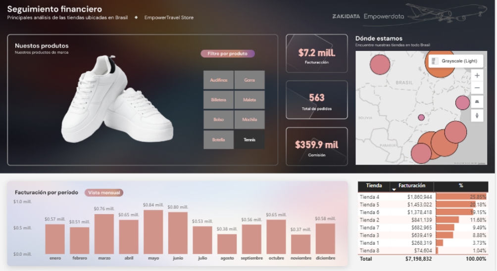
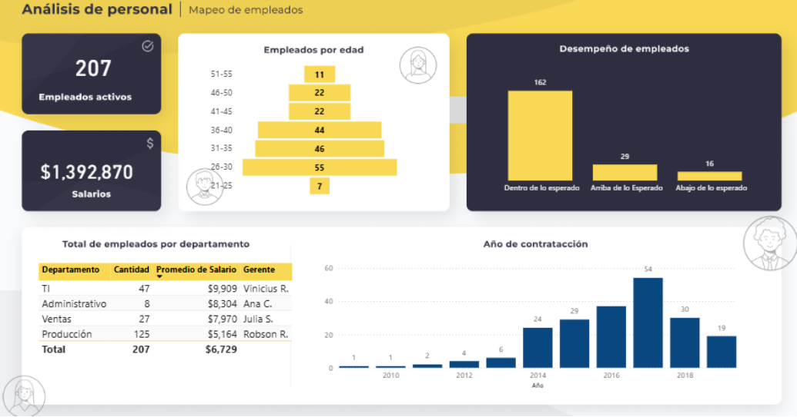

# 📊 Portafolio de Análisis de Datos — Karen Daniela Irias

Analista de Datos con experiencia en **Power BI, SQL, Python y automatización de procesos**. Este repositorio reúne mis proyectos de análisis de datos y Business Intelligence, desarrollados como parte de mi formación práctica para fortalecer competencias en modelado de datos, construcción de dashboards y generación de insights accionables para la toma de decisiones.

📧 karenirias2017ip@gmail.com | 🔗 [LinkedIn](https://linkedin.com/in/karenirias) | 💻 [GitHub](https://github.com/Daniela-Irias27)

---

## 🛠️ Stack Técnico

`Power BI` `DAX` `SQL` `Python` `Power Query` `Excel` `Modelado de Datos` `ETL`

---

## 📁 Proyectos

### 1. Seguimiento Financiero de Tiendas — Retail de Calzado (Power BI)

**Objetivo:** Diseñar un tablero comercial e interactivo para monitorear ventas, facturación y comisiones de una cadena retail de calzado deportivo con 8 tiendas ubicadas en Brasil.

**Insights clave:**
- 💰 Consolidación de **$7.2 millones** en facturación, **563 pedidos** y **$359.9 mil** en comisiones (margen de comisión del 5% sobre la facturación).
- 📈 **Concentración de ingresos:** 3 de las 8 tiendas generaron el **65%** de los ingresos totales.
- ⚠️ **Punto crítico:** la tienda de menor rendimiento aportó solo el **1.04%** del total, evidenciando una oportunidad de intervención comercial.
- 📅 **Estacionalidad:** picos de venta en mayo ($0.84M) y junio ($0.80M).
- 🗺️ Geolocalización de tiendas mediante mapas de calor y filtros dinámicos por categoría de producto.

**Herramientas:** Power BI · DAX · Power Query · Modelado de datos

📥 [Descargar archivo .pbix](./proyecto-tiendas/Analisis-Financiero.pbix) &nbsp;|&nbsp; 📄 [Ver detalle del proyecto](./proyecto-tiendas/README.md)

---

### 2. Dashboard de Análisis de Personal — 207 Empleados (Power BI)

**Objetivo:** Centralizar y analizar en un solo tablero interactivo las métricas clave de RR. HH. de la plantilla laboral, distribuidas en 4 departamentos (TI, Administrativo, Ventas y Producción).

**Insights clave:**
- 👥 Unificación de datos de **207 empleados** y **$1.39 millones** en nómina.
- ✅ **92%** de los colaboradores con desempeño dentro o por encima de lo esperado.
- 📊 Identificación de la estructura demográfica de la plantilla, con concentración en colaboradores de 26-30 años.
- ⚖️ Detección de asimetrías de costo-personal entre departamentos (ej. Producción con 125 empleados vs. TI con el salario promedio más alto).
- 🔄 Automatización del diagnóstico de nómina, contrataciones y desempeño.

**Herramientas:** Power BI · DAX · Power Query · Modelado de datos

📥 [Descargar archivo .pbix](./proyecto-RH
/Dashboard de Analisis de Personal.pbix) &nbsp;|&nbsp; 📄 [Ver detalle del proyecto](./proyecto-RH/README.md)

---

### 3. Análisis de Servicio al Cliente (Power BI)

**Objetivo:** Evaluar el desempeño del área de atención al cliente a partir de indicadores de tiempo de espera, satisfacción y volumen de atenciones, identificando oportunidades de mejora operativa.

**Insights clave:**
- 📞 Análisis de **466 atenciones** totales.
- ✅ **91.63%** de tasa de resolución exitosa.
- ⭐ Satisfacción promedio del cliente de **3.44/5**.
- 👤 Variaciones significativas en tiempos de atención entre agentes de servicio, señalando oportunidades de estandarización operativa.

**Herramientas:** Power BI · DAX · Power Query · Modelado de datos

📥 [Descargar archivo .pbix](./proyecto-Call-Center
/Analisis Call Center.pbix) &nbsp;|&nbsp; 📄 [Ver detalle del proyecto](./proyecto-Call-Center/README.md)

---

## 📌 Nota

Los datasets utilizados en estos proyectos corresponden a casos de negocio simulados, desarrollados con fines de aprendizaje y práctica en análisis de datos y Business Intelligence.

---

## 📬 Contacto

Si quieres conversar sobre estos proyectos o posibles oportunidades, no dudes en escribirme a **karenirias2017ip@gmail.com** o conectar conmigo en [LinkedIn](https://linkedin.com/in/karenirias).

 
